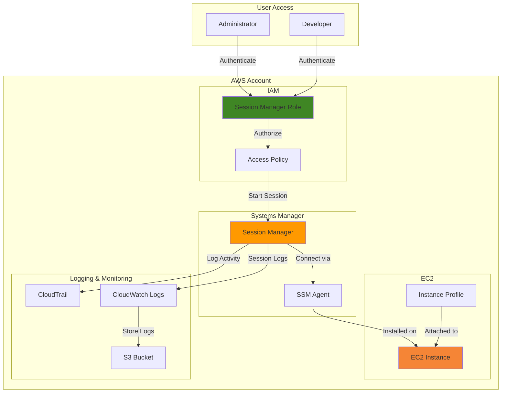

# Accessing Instances with Session Manager

### Problem
Organizations and developers struggle with remote access to EC2 instances, relying on SSH keys, bastion host or opened inbound ports that create several security vulnerabilities. Past approaches require key management, network complexity, and expose attacks surfaces through public facing access points. Sec teams need aubitable, controlled access that eliminates the operational overhead of managing SSH keys while maintaining compliance zero-trust principles.

### Solution
AWS Systems Manager Session Manager provides a secure and auditable way to access EC2 instances without the need for SSH keys or open inbound ports. By using Session Manager, you can establish a secure connection to your instances through the AWS Management Console, AWS CLI, or AWS SDKs. This approach eliminates the need for bastion hosts and reduces the attack surface by keeping instances private.

### Simple Architecture Diagram

### Benefits
- **Enhanced Security**: Eliminates the need for SSH keys and open inbound ports, reducing attack surfaces.
- **Auditable Access**: All session activity is logged in AWS CloudTrail and can be monitored through CloudWatch Logs, providing a complete audit trail for compliance.
- **Simplified Management**: No need for bastion hosts or complex network configurations, making it easier to manage access to instances.
- **Granular Permissions**: Use IAM policies to control who can access which instances and what actions they can perform during a session.
- **Zero Trust Policy**: Only verified personnels can access the instances