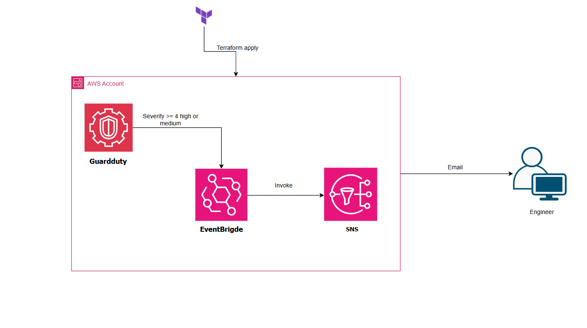

# EventBrigde-SNS-Guardduty


### Problem
Cloud environments are constantly probed. Without automated detection, a threat like an SSH brute force attack, root account usage, or a compromised EC2 instance could go unnoticed for hours or days. Manual log reviews don't scale and human response time is too slow for real security incidents.

---

### Solution
GuardDuty continuously analyses CloudTrail logs, VPC flow logs, and DNS logs using AWS threat intelligence. When it identifies a finding with severity of Medium or above, EventBridge catches the finding in real time, applies a severity filter, and routes it to an SNS topic as the target. SNS delivers an immediate email alert to the detection engineer.

---

### AWS Services used

| Service | Purpose |
|---------|---------|
| Amazon GuardDuty | Continuous threat detection using ML and threat intel |
| Amazon EventBridge | Event routing and severity filtering |
| Amazon SNS | Alert delivery via email subscription |

---


## Prerequisites
 
- AWS account with appropriate IAM permissions
- Terraform >= 1.0.0 installed
- AWS CLI configured (`aws configure`)
- An email address to receive alerts
---
 
## How to deploy
 
```bash
# clone the repo
git clone https://github.com/recklessbud/cloud-projects
cd eventbridge-sns-guardduty
 
# initialise Terraform
terraform init
 
# preview what will be created
terraform plan

fill in the neccesary variables
 
# deploy
terraform apply
```

---

## Security scanning — Checkov
 
This project was scanned with [Checkov](https://www.checkov.io/) before deployment to identify infrastructure misconfigurations.
 
```bash
checkov -d . --framework terraform
```
 
### Finding — CKV2_AWS_3: GuardDuty not scoped to organisation/region
 
**Severity:** Low
**Resource:** `aws_guardduty_detector.EDS_GuardDuty`
 
***fix***
```hcl
 resource "aws_guardduty_organization_configuration" "EDS_GuardDuty" {
   auto_enable = true
   detector_id = aws_guardduty_detector.EDS_GuardDuty.id
 }
```

---

## Testing the pipeline
 
### enerate GuardDuty sample findings
 
```bash
# get your detector ID
DETECTOR_ID=$(aws guardduty list-detectors --query 'DetectorIds[0]' --output text)
 
# generate sample findings
aws guardduty create-sample-findings --detector-id $DETECTOR_ID --finding-types "UnauthorizedAccess:EC2/TorClient"
```
 
After 15 mins, GuardDuty will publish the finding. EventBridge will route it to SNS and an email alert will arrive in your inbox.


### Architecture



### Cleanup

```bash
# destroy the resources
terraform destroy
```

This removes all resources including the GuardDuty detector, EventBridge rule, and SNS topic. GuardDuty charges by the volume of data analysed — always destroy when not in use to avoid unexpected costs.